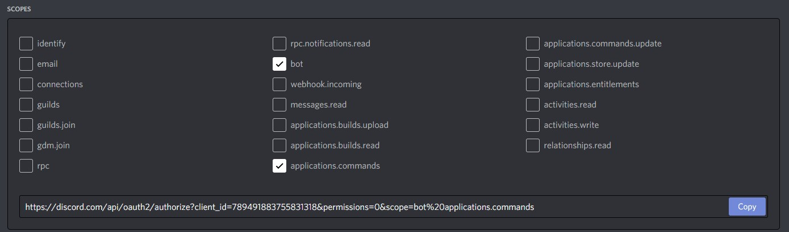

Quickstart
==========

Before doing anything, I highly recommend to read discord.py's quickstart.
You can find it by clicking :ref:`this <discord:quickstart>`.

Let's use this extension real quick.

First of all, let's install this extension.

.. code-block::

    pip install -U discord-py-slash-command

Then, let's invite the bot. See discord.py's bot account create tutorial.
After reading that, there is one more step before inviting your bot. You need to set the scope like this:

Then, invite your bot to your guild.

Now, let's create a simple bot. Create one Python code file.
I'll use ``main.py``.

Then, write like this:

.. code-block:: python

    import discord
    from discord_slash import SlashCommand

    client = discord.Client(intents=discord.Intents.all())
    slash = SlashCommand(client, auto_register=True)

    @client.event
    async def on_ready():
        print("Ready!")

    client.run("your_bot_token_here")

1. 1st and 2nd line is importing library and extension.
2. Then, creates client instance and extension instance.
3. Finally, runs our bot.

Well, now this will run but do literally nothing except printing ``Ready!``.

Let's add one simple command.

Fix your source code like this:

.. code-block:: python

    import discord
    from discord_slash import SlashCommand

    client = discord.Client(intents=discord.Intents.all())
    slash = SlashCommand(client, auto_register=True)

    guild_ids = [789032594456576001] # Put your testing server ID.

    @client.event
    async def on_ready():
        print("Ready!")

    @slash.slash(name="ping", guild_ids=guild_ids)
    async def _ping(ctx):
        await ctx.send(content=f"Pong! ({client.latency*1000}ms)")

    client.run("your_bot_token_here")

I'll explain what is changed:

- ``guild_ids = [789032594456576001]``: This is for adding your command as a guild command. Otherwise, you need to wait for an hour to wait until your command is added.
- ``@slash.slash(name="ping"...)`` ~ ``await ctx.send(...)``: This adds new slash command. This command basically sends an API latency.

Let's do some more complicated things:

.. code-block:: python

    import discord
    from discord_slash import SlashCommand
    from discord_slash import SlashCommandOptionType
    from discord_slash.utils import manage_commands

    client = discord.Client(intents=discord.Intents.all())
    slash = SlashCommand(client, auto_register=True)

    guild_ids = [789032594456576001] # Put your testing server ID.

    @client.event
    async def on_ready():
        print("Ready!")

    @slash.slash(name="ping", guild_ids=guild_ids)
    async def _ping(ctx):
        await ctx.send(content=f"Pong! ({client.latency*1000}ms)")

    @slash.slash(name="echo", guild_ids=guild_ids, options=[manage_commands.create_option("string", "A random string.", SlashCommandOptionType.STRING, True)])
    async def _echo(ctx, string):
        await ctx.send(content=string)

    client.run("your_bot_token_here")

Again, I'll explain what is changed:

- ``from discord_slash.utils import manage_commands``: This imports utility module of this extension.
- ``@slash.slash(name="echo"...)`` ~ ``await ctx.send(...)``: This adds another slash command. This command echos what you typed at ``string``.

What you need to see is ``options``. Unlike discord.py's ext.commands, slash command requires extra effort to add args.
Hopefully, this extension comes with utility function that helps this, which is ``manage_commands.create_option``.
Any other steps are automatically processed by the extension, since we set ``auto_register=True``.

Congratulations! You just created a very simple slash command bot! Yes, this tutorial doesn't cover everything, but
this still has basis of this extension. Now, you should read this document for much more usage and improvement to your bot.

Still have any questions? Feel free to join our discord server by clicking `this <https://discord.gg/KkgMBVuEkx>`_.
