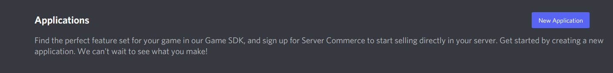
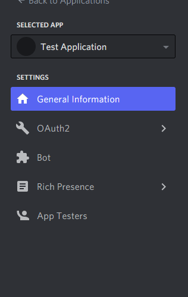
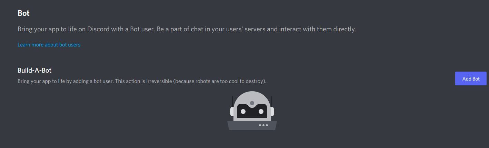
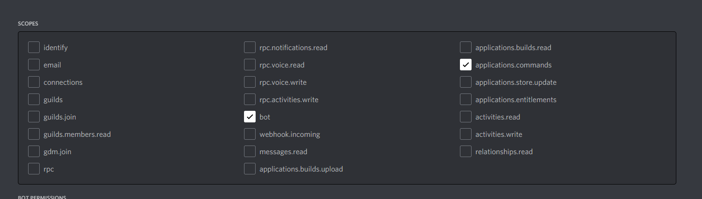
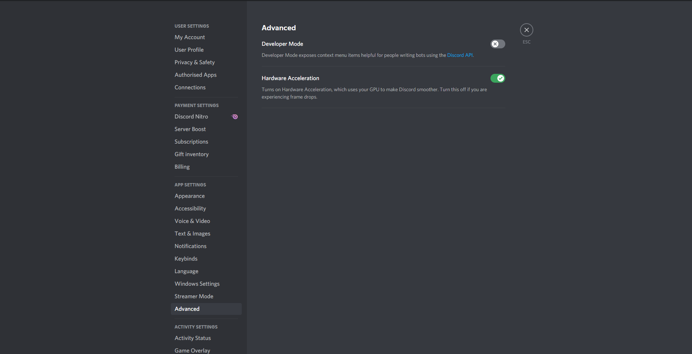
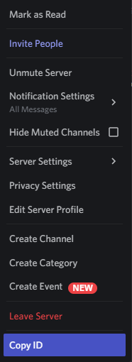
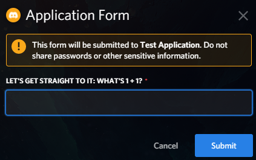

Quickstart
==========

Installing
**********

**discord-interactions** is a :ref:`Python library <index:interactions.py>` for the Discord Application Programming Interface. (API)
A library in Python has to be installed through the `pip` file. Run this in your terminal/command line
in order to install our library:

``pip install -U discord-py-interactions``

Creating a Bot
**************

Before you can run your Bot, you have to create it first. If you did it already, make sure you :ref:`invited <quickstart:Invite the Bot to your guild>` your Bot properly.

In order to create your Bot, you need to create an application first.
Go to the `discord applications page`_ for that. After you logged in, you will see this at the top:

Click the ``New Application`` button, enter a name and then click ``create``.

.. note:: The name you choose is going to be your Bots name.

You will be redirected to a new page. On the left you will see this:

Click on ``Bot``. You again will be redirected to another page, looking like this:

Click on ``Add Bot`` and then on ``Yes, do it!``.

And that's it! You created your Bot!

.. warning::
    You will see a field called ``TOKEN``. This is the access token, used to run your bot.
    You will need this later to start your Bot.

    **Do NOT give this to other persons! They can get full control over your Bot with your token and execute what they want!**

    If you revealed your token, you should **immediately** go to your Bots application page and click the ``Regenerate`` Button under your token. This will delete the old token, so your bot can't be run with it anymore.

Invite the Bot to your guild
^^^^^^^^^^^^^^^^^^^^^^^^^^^^
Now you have a Bot, but you can't create commands because it isn't in any guilds. So, let's invite it to your guild!

.. image:: _static/OAuth2_left.png

Click on ``OAuth2``, then on ``URL Generator``.

You have to enable the ``bot`` and ``application.commands`` scope, to allow your bot to create slash commands.

After setting that up, a ``BOT PERMISSIONS`` field will appear. You can choose permissions you want to have your bot there.

When you are done with choosing the permissions, go to the bottom of the page, copy the the url and open it in a new window.

You will be prompted to a new page. Select your guild, click ``Authorise`` and your Bot should show up in your guild.

Now you can go on with running your bot and creating your first commands!

Running the Bot and creating commands
*************************************

Bots can be a little confusing to create. That's why we've decided to try and make the process
as streamlined as humanly possible, in order for it to be friendlier to understand for our
fellow bot developers. Please note that **a Discord bot should not be your first project if you're
learning how to code**. There are plenty of other projects to consider first before this, as a
Discord bot is not exactly beginner-friendly.

First, let's run the bot:
^^^^^^^^^^^^^^^^^^^^^^^^^

.. code-block:: python

    import interactions

    bot = interactions.Client(token="your_secret_bot_token")

    bot.start()

And that's it! Your bot should now turn online in discord!

Let's take a look now at what is happening here:

* ``import interactions`` -- This is the import line. If this returns a ``ModuleNotFoundError``, please look at our section on how to :ref:`install <quickstart:Installing>` here.
* ``bot = interactions.Client(token="your_secret_bot_token")`` -- This is the ``bot`` variable that defines our bot. This basically instantiates the :ref:`application client <client:Bot Client>`, which requires a ``token`` keyword-argument to be passed. You have to put in your (previously mentioned) secret token here.
* ``bot.start()`` -- Finally, this is what tells our library to turn your bot from offline to online.

Now, let's create our first slash command:
^^^^^^^^^^^^^^^^^^^^^^^^^^^^^^^^^^^^^^^^^^

.. code-block:: python

    import interactions

    bot = interactions.Client(token="your_secret_bot_token")

    @bot.command(
        name="my_first_command",
        description="This is the first command I made!",
        scope=the_id_of_your_guild,
    )
    async def my_first_command(ctx: interactions.CommandContext):
        await ctx.send("Hi there!")

    bot.start()

Now, let's look what the new parts of the code are doing:

* ``@bot.command()`` -- This is something known as a *decorator* in Python. This decorator is in charge and responsible of making sure that the Discord API is told about the slash/sub command that you wish to create, and sends an HTTP request correspondingly. Any changes to the information contained in this decorator will be synchronously updated with the API automatically for you. The ``scope`` field shown here is optional, which represents a guild command if you wish to have a command appear in only specific servers that bot is in. This can be a guild object or the ID.
* ``name`` -- This is the name of your command.
* ``description`` -- This is the description of your command.
* ``async def my_first_command(ctx: interactions.CommandContext):`` -- This here is called our "command coroutine," or what our library internally calls upon each time it recognizes an interaction event from the Discord API that affiliates with the data we've put into the decorator above it. Please note that ``ctx`` is an abbreviation for :ref:`context <context:Event Context>`.
* ``await ctx.send("Hi there!")`` -- This sends the response to your command.

Here is another way we can create the same command:

.. code-block:: python

    import interactions

    bot = interactions.Client(
        token="your_secret_bot_token",
        default_scope=the_id_of_your_guild,
    )

    @bot.command()
    async def my_first_command(ctx: interactions.CommandContext):
        """This is the first command I made!"""
        await ctx.send("Hi there!")

    bot.start()

* The ``name`` field defaults to the coroutine name.
* The ``description`` field defaults to the first line of the coroutine docstring if it exists. If it does not exist, it defaults to ``"No description provided."``.
* ``default_scope`` -- This sets the scope for all the commands automatically. If you want to disable this feature in a specific command, you can add ``default_scope=False`` to the command decorator.
* You could still use the ``scope`` field instead of ``default_scope``.

.. note:: ``name`` and ``description`` are not required.

.. important:: Difference between global and guild slash commands:

    * guild slash commands are instantly available in the guild with the given id. In order to copy your guild ID you have to enable the developer mode in discord and then right-click on the guild. This is also shown in the pictures beyond.
    * global commands are created by *not* including the ``scope`` argument into the ``@bot.command`` decorator. They will appear in all guilds your Bot is in. This process can take up to one hour to be completed on all guilds.

Next, let's create an Option
^^^^^^^^^^^^^^^^^^^^^^^^^^^^

:ref:`Options <models.command:Application Command Models>` are extra arguments of a command, filled in by the user executing the command.

Here is the structure of an option:

.. code-block:: python

    import interactions

    bot = interactions.Client(token="your_secret_bot_token")

    @bot.command(
        name="say_something",
        description="say something!",
        scope=the_id_of_your_guild,
        options = [
            interactions.Option(
                name="text",
                description="What you want to say",
                type=interactions.OptionType.STRING,
                required=True,
            ),
        ],
    )
    async def my_first_command(ctx: interactions.CommandContext, text: str):
        await ctx.send(f"You said '{text}'!")

    bot.start()

The :ref:`@option() <models.command:Application Command Models>` decorator creates options in another way:

.. code-block:: python

    import interactions

    bot = interactions.Client(token="your_secret_bot_token")

    @bot.command(scope=the_id_of_your_guild)
    @interactions.option()
    async def say_something(ctx: interactions.CommandContext, text: str):
        """say something!"""
        await ctx.send(f"You said '{text}'!")

* All arguments in the decorator are keyword arguments only.
* The ``type`` and ``name`` fields default to the typehint and the name of the parameter.
* The ``description`` field is optional and defaults to ``"No description set``.
* The ``required`` field defaults to whether the default for the parameter is empty.
* For typehinting or inputting the ``type`` field, you can use integers, the default Python types, the ``OptionType`` enum, or supported objects such as ``interactions.Channel``.
* Any parameters from ``Option`` can be passed into the ``@option()`` decorator.

.. note::
    The limit for options per command is 25.

Nested commands: subcommands
^^^^^^^^^^^^^^^^^^^^^^^^^^^^

Subcommands are options that are nested to create subcategories of commands.

Here is the structure of a subcommand:

.. code-block:: python

    @bot.command(
        name="base_command",
        description="This description isn't seen in UI (yet?)",
        scope=guild_id,
        options=[
            interactions.Option(
                name="command_name",
                description="A descriptive description",
                type=interactions.OptionType.SUB_COMMAND,
                options=[
                    interactions.Option(
                        name="option",
                        description="A descriptive description",
                        type=interactions.OptionType.INTEGER,
                        required=False,
                    ),
                ],
            ),
            interactions.Option(
                name="second_command",
                description="A descriptive description",
                type=interactions.OptionType.SUB_COMMAND,
                options=[
                    interactions.Option(
                        name="second_option",
                        description="A descriptive description",
                        type=interactions.OptionType.STRING,
                        required=True,
                    ),
                ],
            ),
        ],
    )
    async def cmd(ctx: interactions.CommandContext, sub_command: str, second_option: str = "", option: int = None):
        if sub_command == "command_name":
            await ctx.send(f"You selected the command_name sub command and put in {option}")
        elif sub_command == "second_command":
            await ctx.send(f"You selected the second_command sub command and put in {second_option}")

You can also create subcommands using the command system:

.. code-block:: python

    import interactions

    bot = interactions.Client(token="your_secret_bot_token")

    @bot.command(scope=guild_id)
    async def base_command(ctx: interactions.CommandContext):
        """This description isn't seen in UI (yet?)"""
        pass

    @base_command.subcommand()
    @interactions.option(description="A descriptive description")
    async def command_name(ctx: interactions.CommandContext, option: int = None):
        """A descriptive description"""
        await ctx.send(f"You selected the command_name sub command and put in {option}")

    @base_command.subcommand()
    @interactions.option(description="A descriptive description")
    async def second_command(ctx: interactions.CommandContext, second_option: str):
        """A descriptive description"""
        await ctx.send(f"You selected the second_command sub command and put in {second_option}")

.. note::
    You can add a SUB_COMMAND_GROUP in between the base and command.

Additional information about subcommands
^^^^^^^^^^^^^^^^^^^^^^^^^^^^^^^^^^^^^^^^

Base commands are returned the :ref:`Command <models.command:Application Command Models>` object.
From this, you can utilize the following decorators:

* :ref:`@subcommand() <models.command:Application Command Models>`: creates a subcommand.
* :ref:`@group() <models.command:Application Command Models>`: creates a group.
* :ref:`@error <models.command:Application Command Models>`: registers an error callback.

Check the documentation for the parameters of each of these decorators.

The following is an example of a base command:

.. code-block:: python

    @bot.command()
    async def base_command(ctx: interactions.CommandContext):
        pass

The examples below will be using the base command above.

The following is an example of a subcommand of the base command:

.. code-block:: python

    @base_command.subcommand()
    async def subcommand(ctx: interactions.CommandContext, base_res: interactions.BaseResult):
        pass

This code results in the following subcommand: `/base_command subcommand`.

.. note::
    You can use the ``base_res`` parameter in groups and subcommands, and ``group_res`` in subcommands inside groups
    to access the result of the previous callback. They are both optional and are placed right after the ``ctx`` parameter.

The following is an example of a group with subcommands:

.. code-block:: python

    @base_command.group()
    async def group(ctx: interactions.CommandContext, base_res: interactions.BaseResult):
        pass

    @group.subcommand()
    async def subcommand_group(ctx: interactions.CommandContext, group_res: interactions.GroupResult):
        pass

You can have multiple groups, with multiple subcommands in each group.
Subcommands and groups are options, so the same restrictions apply.

.. note:: Create any subcommands without groups *before* creating any groups.

Since there are multiple coroutines involved that each get executed, you may
be wondering how you can stop the chain. Luckily, there is a way:

.. code-block:: python

    @bot.command()
    async def foo(ctx):
        ... # do something
        return StopCommand  # does not execute `bar`

    @foo.subcommand()
    async def bar(ctx):
        ...  # `bar` is not executed

This works on both groups and subcommands.

The following is an example of an error callback:

.. code-block:: python

    @bot.command()
    async def foo(ctx: interactions.CommandContext):
        ... # do something
        raise Exception("Something went wrong")
        # Most likely, you won't be the one
        # raising the error, it may just be
        # a bug or mistake with your code.

    @foo.error
    async def foo_error(ctx: interactions.CommandContext, error: Exception):
        ... # do something

The parameters ``ctx`` and ``error`` are required, but you can have more
parameters, such as ``*args`` and ``**kwargs``, if you need to access options.

.. note::
    You can have one error callback per command.

Special type of commands: Context menus
^^^^^^^^^^^^^^^^^^^^^^^^^^^^^^^^^^^^^^^

While, granted that application commands are way more intuitive and easier to work with as both
a bot developer and user from a UX approach, some may not want to always type the same command
over and over again to repeat a repetitive task. Introducing: **context menus.** Also
known as "user" and "message" respectively, this simple switch in command structure allows you to
quickly empower your bot with the ability to make right-click actions with menial effort.

In order to create a menu-based command, all you need to do is simply add this one line into
your ``@command`` decorator:

.. code-block:: python

    @bot.command(
        type=interactions.ApplicationCommandType.USER,
        name="User Command",
        scope=1234567890
    )
    async def test(ctx):
        await ctx.send(f"You have applied a command onto user {ctx.target.user.username}!")

Here is an alternate way of creating a context menu:

.. code-block:: python

    @bot.user_command(name="User Command", scope=1234567890)
    async def test(ctx):
        await ctx.send(f"You have applied a command onto user {ctx.target.user.username}!")

.. important::
    The structure of a menu command differs significantly from that of a regular one:

    - You cannot have any options or choices.
    - You cannot have a description.
    - The ``name`` filter follows a different regex pattern.

Creating and sending Components
*******************************

Being able to run your own commands is very useful for a lot of automation-related purposes
as a bot developer, however, we also have something that we're able to introduce for both
the developer and a user to use that will be the "sprinkles" on top of a cupcake, so-to-speak:
components.

Components are ways of being able to select pre-defined data, or define your own. They're very
simple but quite powerful when put into practice This code block below shows a simplified
implementation of a component:

.. code-block:: python

    button = interactions.Button(
        style=interactions.ButtonStyle.PRIMARY,
        label="hello world!",
        custom_id="hello"
    )

    @bot.command(
        name="button_test",
        description="This is the first command I made!",
        scope=the_id_of_your_guild,
    )
    async def button_test(ctx):
        await ctx.send("testing", components=button)

    @bot.component("hello")
    async def button_response(ctx):
        await ctx.send("You clicked the Button :O", ephemeral=True)

    bot.start()

This is a design that we ended up choosing to simplify responding
to buttons when someone presses on one, and to allow bot developers
to plug in *which* button they want a response to. No more ``wait_for_component``
and ``wait_for`` functions with huge if-else chains; this removes
redundancy in your code and overall eases into the practice of modularity.

What kinds of components are there?
^^^^^^^^^^^^^^^^^^^^^^^^^^^^^^^^^^^

As a bot developer, this may be fairly important for you to want to know.
Different components provide difference user experiences, interactions
and results. Currently you can choose between three components that Discord
provides: a ``Button``, ``SelectMenu`` and ``TextInput``. You're able to `find these component
types`_ here.

How do I send components in a row?
^^^^^^^^^^^^^^^^^^^^^^^^^^^^^^^^^^

You are also able to organize these components into rows, which are defined
as ``ActionRow``'s. It is worth noting that you can have only a maximum of
5 per message that you send. This code block below shows how:

.. code-block:: python

    button = interactions.Button(
        style=interactions.ButtonStyle.PRIMARY,
        label="hello world!",
        custom_id="hello",
    )

    button2 = interactions.Button(
        style=interactions.ButtonStyle.DANGER,
        label="bye bye!",
        custom_id="bye!",
    )

    row = interactions.ActionRow(
        components=[button1, button2]
    )
    # or:
    row = interactions.ActionRow.new(button1, button2)
    # or:
    row = interactions.spread_to_rows(button1, button2)
    # spread_to_rows returns a list of rows

    @bot.command(...)
    async def test(ctx):
        await ctx.send("rows!", components=row)

By default, the ``components`` keyword-argument field in the context sending
method will always support ``ActionRow``-less sending: you only need to declare
rows whenever you need or want to. This field will also support raw arrays and
tables, if you so wish to choose to not use our class objects instead.

.. important:: You cannot use ``TextInput`` with the above shown method.
    Look :ref:`here <quickstart:Creating a TextInput>` how to create and send them.

Creating a TextInput
^^^^^^^^^^^^^^^^^^^^
You want to get a Text from a user? You can use ``TextInput`` for that.

.. code-block:: python

        interactions.TextInput(
            style=interactions.TextStyleType.SHORT,
            label="Let's get straight to it: what's 1 + 1?",
            custom_id="text_input_response",
            min_length=1,
            max_length=3,
        )

But how to send it? You can't use ``ctx.send`` for it. Take a look at :ref:`Modals <quickstart:Modals>` for that.

Modals
******
Modals are a new way to interact with a user. Currently only a ``TextInput`` component is supported. You can have up to five ``TextInput`` in a Modal.

.. code-block:: python

    async def my_cool_modal_command(ctx):
        modal = interactions.Modal(
            title="Application Form",
            custom_id="mod_app_form",
            components=[interactions.TextInput(...)],
        )

        await ctx.popup(modal)

with the ``TextInput`` example from above we get:

Responding to a Modal interaction
^^^^^^^^^^^^^^^^^^^^^^^^^^^^^^^^^^

.. code-block:: python

    @bot.modal("mod_app_form")
    async def modal_response(ctx, response: str):
        await ctx.send(f"You wrote: {response}", ephemeral=True)

You can respond to a modal the same way as you would respond to a normal ``chat-input`` command, except your function has an extra argument for the text what was put into the modal.

Adding v2 Permissions
^^^^^^^^^^^^^^^^^^^^^

v2 permissions consist of the ``default_member_permissions`` and ``dm_permission`` keyword arguments.
Similar to adding privileged intents, you add permissions (like admin-only, ``BAN_MEMBERS``-only, etc.) as follows:

.. code-block:: python

    @bot.command(
        name="sudo",
        description="Fake a command as if its done by someone else.",
        default_member_permissions=interactions.Permissions.ADMINISTRATOR,  # admin-only
        options=[interactions.Option(
                        name="response",
                        description="What command you want to execute",
                        type=interactions.OptionType.STRING,
                        required=True,
                    )]
    )
    async def sudo(ctx, response: str):
        await ctx.send(f"You wrote: {response}", ephemeral=True)

    # This is the same command however, the below example covers more than 1 permission.

    @bot.command(
        name="sudo",
        description="Fake a command as if its done by someone else.",
        default_member_permissions=interactions.Permissions.ADMINISTRATOR | interactions.Permissions.MOVE_MEMBERS,
        options=[interactions.Option(
                        name="response",
                        description="What command you want to execute",
                        type=interactions.OptionType.STRING,
                        required=True,
                    )]
    )
    async def sudo(ctx, response: str):
        await ctx.send(f"You wrote: {response}", ephemeral=True)

    # Just a disclaimer, these examples are not meant to be used line by line because
    # you can't have more than 1 global command with the same name

Adding guild-only commands is easier as the only thing it takes is a boolean.
Here's an example of a guild-only command:

.. code-block:: python

    @bot.command(
        name="sudo",
        description="Fake a command as if its done by someone else.",
        dm_permission=False,  # Guild-only
        options=[interactions.Option(
                        name="response",
                        description="What command you want to execute",
                        type=interactions.OptionType.STRING,
                        required=True,
                    )]
    )
    async def sudo(ctx, response: str):
        await ctx.send(f"You wrote: {response}", ephemeral=True)

Likewise, setting ``dm_permission`` to ``True`` makes it usable in DMs. Just to note that this argument's mainly used for
global commands. Guild commands with this argument will have no effect.

Utilities
^^^^^^^^^

You can use the following utilities to help you with your commands:

* ``ActionRow.new()``: Creates a new ``ActionRow`` object.
* ``spread_to_rows()``: Spreads a list of components into a list of rows.
* ``@autodefer()``: Automatically defers a command if it did not respond within the specified time.

Look at their documentation :ref:`here <utils:Utilities>` for more information.

Usage of ``ActionRow.new()``:

.. code-block:: python

    from interactions import ActionRow, Button

    @bot.command()
    async def command(ctx):
        b1 = Button(style=1, custom_id="b1", label="b1")
        b2 = Button(style=1, custom_id="b2", label="b2")
        b3 = Button(style=1, custom_id="b3", label="b3")
        b4 = Button(style=1, custom_id="b4", label="b4")

        await ctx.send("Components:", components=ActionRow.new(b1, b2, b3, b4))
        # instead of the cumbersome ActionRow(components=[b1, b2, b3, b4])

Usage of ``spread_to_rows()``:

.. code-block:: python

    from interactions import Button, SelectMenu, SelectOption, spread_to_rows

    @bot.command()
    async def command(ctx):
        b1 = Button(style=1, custom_id="b1", label="b1")
        b2 = Button(style=1, custom_id="b2", label="b2")
        s1 = SelectMenu(
            custom_id="s1",
            options=[
                SelectOption(label="1", value="1"),
                SelectOption(label="2", value="2"),
            ],
        )
        b3 = Button(style=1, custom_id="b3", label="b3")
        b4 = Button(style=1, custom_id="b4", label="b4")

        await ctx.send("Components:", components=spread_to_rows(b1, b2, s1, b3, b4))

Usage of ``@autodefer()``:

.. code-block:: python

    from interactions import autodefer
    import asyncio

    @bot.command()
    @autodefer()  # configurable
    async def command(ctx):
        await asyncio.sleep(5)
        await ctx.send("I'm awake now!")

.. _Client: https://interactionspy.rtfd.io/en/latest/client.html
.. _find these component types: https://interactionspy.readthedocs.io/en/latest/models.component.html
.. _discord applications page: https://discord.com/developers/applications
