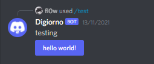

Quickstart
==========

Looking into trying to get started with our library? Well, you've come to the right page then!

.. note::

    This quickstart guide is extremely rough and contains experimental code.
    Do not follow us strictly until v4.0 is released! Everything is subject
    to change in here due to the development of the API wrapper continuously
    being reflected.

Installing
**********

**discord-interactions** is a Python library for the Discord Artificial Programming Interface. (API)
A library in Python has to be installed through the `pip` file. Run this in your terminal/command line
in order to install our library:

``pip install -U discord-interactions``

If you're unable to run it through your terminal/command line, you need to make sure that it's
accessible as an Environment Path. Search more on Google for how to do this.

Minimal Bot
***********

Bots can be a little confusing to create. That's why we've decided to try and make the process
as streamlined as humanly possible, in order for it to be friendlier to understand for our
fellow bot developers. Please note that **a Discord bot should not be your first project if you're
learning how to code**. There are plenty of other projects to consider first before this, as a
Discord bot is not exactly beginner-friendly.

This code block below shows a simple bot being created:

.. code-block:: python

    import interactions

    bot = interactions.Client(token="...")

    @bot.command(
        name="test",
        description="this is just a test command.",
        scope=1234567890
    )
    async def test(ctx):
        print("we're here so far.")
        # await ctx.send("Hello world!")

    bot.start()

There's quite a lot of things that are going on here, so let's break it down step-by-step:

* ``import interactions`` -- This is the import line. If this returns a ``ModuleNotFoundError``, please look at our `Installing`_ section here.
* ``bot = interactions.Client(token="...")`` -- This is the ``bot`` variable that defines our bot. This basically instantiates the `Client`_ class, which requires a ``token`` keyword-argument to be passed. In order to get a token, please look at the image given below.
* ``@bot.command()`` -- This is something known as a *decorator* in Python. This decorator is in charge and responsible of making sure that the Discord API is told about the slash/sub command that you wish to create, and sends an HTTP request correspondingly. Any changes to the information contained in this decorator will be synchronously updated with the API automatically for you. The ``scope`` field shown here is optional, which represents a guild command if you wish to have a command appear in only specific servers that bot is in. This can be a guild object or the ID.
* ``bot.start()`` -- Finally, this is what tells our library to turn your bot from offline to online.

.. image:: _static/client_token.png

And it's really as simple as that! If you would like to learn more about what our library offers, or see
more examples of our code, please be sure to check out our `coding examples`_ page on our docs!

Context menus
*************

Documentation for this will be coming soon.

Components
**********

Being able to run your own commands is very useful for a lot of automation-related purposes
as a bot developer, however, we also have something that we're able to introduce for both
the developer and a user to use that will be the "sprinkles" on top of a cupcake, so-to-speak:
components.

Components are ways of being able to select pre-defined data, or define your own. They're very
simple but quite powerful when put into practice This code block below shows a simplified
implementation of a component:

.. code-block:: python

    import interactions

    bot = interactions.Client(token="...")
    button = interactions.Button(
        style=interactions.ButtonStyle.PRIMARY,
        label="hello world!",
        custom_id="hello"
    )

    @bot.command(
        name="test",
        description="this is just a test command.",
        scope=1234567890
    )
    async def test(ctx):
        await ctx.send("testing", components=button)

    @bot.component(button)
    async def button_response(ctx):
        print("someone clicked the button! :O")

This is a design that we ended up choosing to simplify responding
to buttons when someone presses on one, and to allow bot developers
to plug in *which* button they want a response to. No more ``wait_for_component``
and ``wait_for`` functions with huge if-else chains; this removes
redundancy in your code and overall eases into the practice of modularity. This code block
shown above will give a response that will apear something like this:

What kinds of components are there?
^^^^^^^^^^^^^^^^^^^^^^^^^^^^^^^^^^^

As a bot developer, this may be fairly important for you to want to know.
Different components provide difference user experiences, interactions
and results. Currently you can choose between two components that Discord
provides: a ``Button`` and ``SelectMenu``. You're able to `find these component
types`_ here.

How do I send components in a row?
^^^^^^^^^^^^^^^^^^^^^^^^^^^^^^^^^^

You are also able to organize these components into rows, which are defined
as ``ActionRow``'s. It is worth noting that you can have only a maximum of
5 per message that you send. This code block below shows how:

.. code-block:: python

    ...

    button = interactions.Button(
        style=interactions.ButtonStyle.PRIMARY,
        label="hello world!",
        custom_id="hello"
    )
    menu = interactions.SelectMenu(
        options=[
            interactions.SelectOption(label="Option one", value="o-one"),
            interactions.SelectOption(label="Option two", value="o-two"),
            interactions.SelectOption(label="Option three", value="o-three")
        ]
    )
    row = interactions.ActionRow(
        components=[button, menu]
    )

    ...

    @bot.command(...)
    async def test(ctx):
        await ctx.send("rows!", components=row)

By default, the ``components`` keyword-argument field in the context sending
method will always support ``ActionRow``-less sending: you only need to declare
rows whenever you need or want to. This field will also support raw arrays and
tables, if you so wish to choose to not use our class objects instead.

.. _Client: https://discord-interactions.rtfd.io/en/unstable/client.html
.. _Installing: https://discord-interactions.rtfd.io/en/unstable/quickstart.html#installing
.. _coding examples: /#/
.. _find these component types: https://discord-interactions.readthedocs.io/en/unstable/models.component.html
