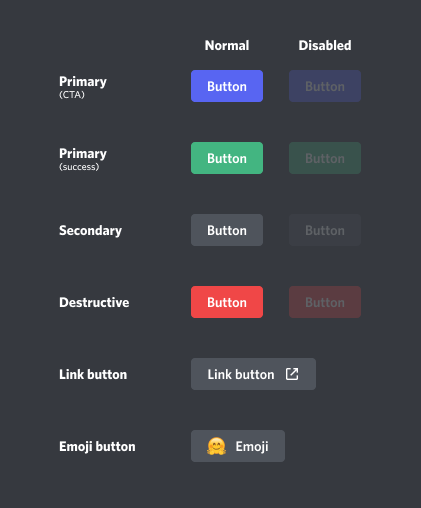

# Components

Components (Buttons, Select Menus and soon Text Input Fields) can be added to any message by passing them to the `components` argument in any `.send()` method.

## Layout

All types of components must be part of Action Rows, which are containers that a message can have. Each message can have up to 5 action rows, with each action row containing a maximum of 5 buttons OR a single select menu.

If you don't really care of the layout in which your components are set, you can pass in directly the components without actually creating the Action Rows - the library will handle it itself. However, if the layout is important for you (let's say, you want a row with 3 buttons, then a row with a select menu and finally another row with 2 buttons), then you will need to specify the layout yourself by either defining the action rows or using the `spread_to_rows()` function.

They are organised in a 5x5 grid, so you either have to manage the layout yourself, use `spread_to_rows()` where we organise them for you, or have a single component.

If you want to define the layout yourself, you have to put them in an `ActionRow()`. The `components` parameter need a list of up to five `ActionRow()`.

=== ":one: No special layout"
    Your list of components will be transformed into `ActionRow`s behind the scenes.

    ```python
    from interactions import Button, ButtonStyle

    components = Button(
        style=ButtonStyle.GREEN,
        label="Click Me",
    )

    await channel.send("Look, Buttons!", components=components)
    ```

=== ":two: `ActionRow()`"
    ```python
    from interactions import ActionRow, Button, ButtonStyle

    components: list[ActionRow] = [
        ActionRow(
            Button(
                style=ButtonStyle.GREEN,
                label="Click Me",
            ),
            Button(
                style=ButtonStyle.GREEN,
                label="Click Me Too",
            )
        )
    ]

    await channel.send("Look, Buttons!", components=components)
    ```

=== ":three: `spread_to_rows()`"
    ```python
    from interactions import ActionRow, Button, ButtonStyle, spread_to_rows

    components: list[ActionRow] = spread_to_rows(
        Button(
            style=ButtonStyle.GREEN,
            label="Click Me",
        ),
        Button(
            style=ButtonStyle.GREEN,
            label="Click Me Too",
        )
    )

    await channel.send("Look, Buttons!", components=components)
    ```

For simplicity's sake, example one will be used for all examples going forward.

If you want to delete components, you need to pass `components=[]` to `.edit()`.

## Buttons

Buttons can be clicked on, or be set as disabled if you wish.

```python
components = Button(
    style=ButtonStyle.GREEN,
    label="Click Me",
    disabled=False,
)

await channel.send("Look a Button!", components=components)
```

For more information, please visit the API reference [here](/interactions.py/API Reference/API Reference/models/Discord/components/#interactions.models.discord.components.Button).

### Button Styles

There are a bunch of colours and styles you can choose from.
    <br>

The colours correspond to the styles found in `ButtonStyle`. Click [here](/interactions.py/API Reference/API Reference/models/Discord/enums/#interactions.models.discord.enums.ButtonStyle) for more information.

If you use `ButtonStyle.URL`, you can pass a URL to the button with the `url` argument. Users who click the button will get redirected to your URL.
```python
from interactions import ButtonStyle

components = Button(
    style=ButtonStyle.URL,
    label="Click Me",
    url="https://github.com/interactions-py/interactions.py",
)

await channel.send("Look a Button!", components=components)
```

`ButtonStyle.URL` does not receive events, or work with callbacks.

## Select Menus

Sometimes there might be more than a handful options which users need to decide between. That's when a `SelectMenu` should probably be used.

Select Menus are very similar to Buttons. The main difference is that you get a list of options to choose from.

If you want to use string options, then you use the `StringSelectMenu`. Simply pass a list of strings to `options` and you are good to go. You can also explicitly pass `SelectOptions` to control the value attribute.

You can also define how many options users can choose by setting `min_values` and `max_values`.

```python
from interactions import StringSelectMenu

components = StringSelectMenu(
    "Pizza", "Pasta", "Burger", "Salad",
    placeholder="What is your favourite food?",
    min_values=1,
    max_values=1,
)

await channel.send("Look a Select!", components=components)
```
???+ note
    You can only have up to 25 options in a Select

Alternatively, you can use `RoleSelectMenu`, `UserSelectMenu` and `ChannelSelectMenu` to select roles, users and channels respectively. These select menus are very similar to `StringSelectMenu`, but they don't allow you to pass a list of options; it's all done behind the scenes.

For more information, please visit the API reference [here](/interactions.py/API Reference/API Reference/models/Discord/components/#interactions.models.discord.components.Select).

## Responding

Now that we know how to send components, we need to learn how to respond to a user when a component is interacted with.
There are three ways to respond to components.

If you add your component to a temporary message asking for additional user input, you should probably use `bot.wait_for_component()`.
These have the downside that, for example, they won't work anymore after restarting your bot. On the positive side, they are defined in the same function where your button is sent, so you can easily use variables that you defined *before* the user used the component.

Otherwise, you are looking for a persistent callback. For that, you want to define a `custom_id` when creating your component.

When responding to a component you need to satisfy Discord either by responding to the context with `ctx.send()` or by editing the component with `ctx.edit_origin()`.

=== ":one: `bot.wait_for_component()`"
    This function supports checks and timeouts.

    In this example, we are checking that the username starts with "a" and clicks the button within 30 seconds. If his username doesn't start with an "a", then we send it an ephemeral message to notify him. If the button times out, we edit the message so that the button is disabled and cannot be clicked anymore.

    ```python
    from interactions import Button, ButtonStyle
    from interactions.api.events import Component

    # defining and sending the button
    button = Button(
        custom_id="my_button_id",
        style=ButtonStyle.GREEN,
        label="Click Me",
    )
    message = await channel.send("Look a Button!", components=button)

    # define the check
    async def check(component: Component) -> bool:
        if component.ctx.author.username.startswith("a"):
            return True
        else:
            await component.ctx.send("Your name does not start with an 'a'!", ephemeral=True)

    try:
        # you need to pass the component you want to listen for here
        # you can also pass an ActionRow, or a list of ActionRows. Then a press on any component in there will be listened for
        used_component: Component = await bot.wait_for_component(components=button, check=check, timeout=30)

    except TimeoutError:
        print("Timed Out!")

        button.disabled = True
        await message.edit(components=button)

    else:
        await used_component.ctx.send("Your name starts with 'a'")
    ```

    You can also use this to check for a normal message instead of a component interaction.

    For more information, please visit the API reference [here](/interactions.py/API Reference/API Reference/client/#interactions.client.client.Client.wait_for_component).


=== ":two: Persistent Callback: `@listen()`"
    You can listen to the `on_component()` event and then handle your callback. This works even after restarts!

    ```python
    from interactions import Button, ButtonStyle
    from interactions.api.events import Component

    # defining and sending the button
    button = Button(
        custom_id="my_button_id",
        style=ButtonStyle.GREEN,
        label="Click Me",
    )
    await channel.send("Look a Button!", components=button)

    @listen(Component)
    async def on_component(event: Component):
        ctx = event.ctx

        match ctx.custom_id:
            case "my_button_id":
                await ctx.send("You clicked it!")
    ```

=== ":three: Persistent Callback: `@component_callback()`"
    If you have a lot of components, putting everything in the `on_component()` event can get messy really quick.

    Similarly to Option 1, you can define `@component_callback` listeners. This works after restarts too.

    You have to pass your `custom_id` to `@component_callback(custom_id)` for the library to be able to register the callback function to the wanted component.

    ```python
    from interactions import Button, ButtonStyle, ComponentContext, component_callback

    # defining and sending the button
    button = Button(
        custom_id="my_button_id",
        style=ButtonStyle.GREEN,
        label="Click Me",
    )
    await channel.send("Look a Button!", components=button)

    # you need to pass your custom_id to this decorator
    @component_callback("my_button_id")
    async def my_callback(ctx: ComponentContext):
        await ctx.send("You clicked it!")
    ```

=== ":four: Persistent Callbacks, with regex"
    Regex (regular expressions) can be a great way to pass information from the component creation directly to the component response callback, in a persistent manner.

    Below is an example of how regex can be used to create a button and how to respond to it.

    ```python
    import re
    from interactions import Button, ButtonStyle, ComponentContext, SlashContext, component_callback, slash_command

    @slash_command(name="test")
    async def command(ctx: SlashContext):
        id = "123456789"  # random ID, could be anything (a member ID, a message ID...)
        button = Button(
            custom_id=f"button_{id}",
            style=ButtonStyle.GREEN,
            label="Click Me",
        )
        await ctx.send(components=button)


    # define the pattern of the button custom_id
    regex_pattern = re.compile(r"button_([0-9]+)")

    @component_callback(regex_pattern)
    async def button_callback(ctx: ComponentContext):
        match = regex_pattern.match(ctx.custom_id)
        if match:
            id = match.group(1)  # extract the ID from the custom ID
            await ctx.send(f"Custom ID: {ctx.custom_id}. ID: {id}")  # will return: "Custom ID: button_123456789. ID: 123456789"
    ```

    Just like normal `@component_callback`, you can specify a regex pattern to match your custom_ids, instead of explicitly passing strings.
    This is useful if you have a lot of components with similar custom_ids, and you want to handle them all in the same callback.

    Please do bare in mind that using regex patterns can be a bit slower than using strings, especially if you have a lot of components.

???+ note
    As explained previously, the main difference between a Button and a Select Menu is that you can retrieve a list of options that were chosen by the user for a Select Menu.
    In this case, this list of options can be found in `ctx.values`.
